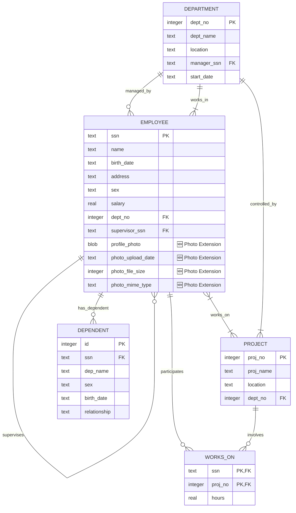

# Enhanced Employee Management System - ER Diagram

## Database Schema with Photo Extension (SRS Document 2)

### **Entity-Relationship Diagram - Updated Version**

This document presents the complete Entity-Relationship diagram for the Employee Management System with the **Employee Profile Photo Extension** as specified in SRS Document 2.

---

## **🔹 Entities and Attributes**

### **1. Employee (Enhanced with Photo Support)**

- **ssn** (Primary Key) - TEXT
- **name** - TEXT (NOT NULL)
- **birth_date** - TEXT (NOT NULL)
- **address** - TEXT (NOT NULL)
- **sex** - TEXT (NOT NULL, CHECK: 'M' or 'F')
- **salary** - REAL (NOT NULL)
- **dept_no** - INTEGER (Foreign Key → Department)
- **supervisor_ssn** - TEXT (Foreign Key → Employee)
- **🆕 profile_photo** - BLOB (Employee profile image data)
- **🆕 photo_upload_date** - TEXT (Timestamp of photo upload)
- **🆕 photo_file_size** - INTEGER (File size in bytes)
- **🆕 photo_mime_type** - TEXT (Image MIME type: image/jpeg, image/png)

### **2. Department**

- **dept_no** (Primary Key) - INTEGER
- **dept_name** - TEXT (NOT NULL)
- **location** - TEXT (NOT NULL)
- **manager_ssn** - TEXT (Foreign Key → Employee)
- **start_date** - TEXT

### **3. Project**

- **proj_no** (Primary Key) - INTEGER
- **proj_name** - TEXT (NOT NULL)
- **location** - TEXT (NOT NULL)
- **dept_no** - INTEGER (Foreign Key → Department)

### **4. Works_On (Relationship Entity)**

- **ssn** (Primary Key, Foreign Key → Employee) - TEXT
- **proj_no** (Primary Key, Foreign Key → Project) - INTEGER
- **hours** - REAL (NOT NULL)

### **5. Dependent**

- **id** (Primary Key) - INTEGER (AUTOINCREMENT)
- **ssn** (Foreign Key → Employee) - TEXT
- **dep_name** - TEXT (NOT NULL)
- **sex** - TEXT (NOT NULL, CHECK: 'M' or 'F')
- **birth_date** - TEXT (NOT NULL)
- **relationship** - TEXT (NOT NULL)

---

## **🔹 Relationships**

### **1. Employee ↔ Department**

- **WORKS_IN**: Employee.dept_no → Department.dept_no
- **MANAGES**: Department.manager_ssn → Employee.ssn
- **Cardinality**: Many-to-One (Many employees work in one department)

### **2. Employee ↔ Employee (Supervision)**

- **SUPERVISES**: Employee.supervisor_ssn → Employee.ssn
- **Cardinality**: Many-to-One (Many employees report to one supervisor)

### **3. Employee ↔ Project (Works_On)**

- **WORKS_ON**: Many-to-Many relationship
- **Participation**: Employee can work on multiple projects, Project can have multiple employees
- **Attributes**: hours (time spent on project)

### **4. Project ↔ Department**

- **CONTROLS**: Project.dept_no → Department.dept_no
- **Cardinality**: Many-to-One (Many projects controlled by one department)

### **5. Employee ↔ Dependent**

- **HAS_DEPENDENT**: Dependent.ssn → Employee.ssn
- **Cardinality**: One-to-Many (One employee can have multiple dependents)

---

## **🔹 Mermaid ER Diagram Code**



---

## **🔹 Database Normalization - BCNF Compliance**

### **Enhanced Schema Analysis**

The updated database schema maintains **Boyce-Codd Normal Form (BCNF)** compliance:

#### **Employee Table (Enhanced)**

- **Primary Key**: ssn
- **Functional Dependencies**:
  - ssn → name, birth_date, address, sex, salary, dept_no, supervisor_ssn
  - **🆕 ssn → profile_photo, photo_upload_date, photo_file_size, photo_mime_type**
- **BCNF Compliance**: ✅ All non-key attributes are fully functionally dependent on the primary key

#### **Photo Extension Fields**

- **profile_photo**: BLOB data for multimodal storage
- **photo_upload_date**: Timestamp for audit trail
- **photo_file_size**: Storage optimization metadata
- **photo_mime_type**: Content type for proper serving

### **Key Constraints**

- **CHECK Constraints**: sex IN ('M', 'F') for Employee and Dependent
- **Foreign Key Constraints**: Maintain referential integrity
- **NOT NULL Constraints**: Ensure data completeness for critical fields

---

## **🔹 Photo Extension Specifications (SRS Document 2)**

### **Multimodal Data Handling**

- **Supported Formats**: JPEG, PNG
- **Storage Method**: BLOB in SQLite database
- **Security**: File type validation, size limits (5MB)
- **Metadata**: Complete audit trail with timestamps and file information

### **API Integration**

- **GET** `/api/employees/:ssn/photo` - Retrieve photo
- **POST** `/api/employees/:ssn/photo` - Upload new photo
- **PUT** `/api/employees/:ssn/photo` - Update existing photo
- **DELETE** `/api/employees/:ssn/photo` - Remove photo

### **Frontend Features**

- Photo thumbnails in employee listing
- Upload modal with preview functionality
- File validation and progress indicators
- Responsive design with Tailwind CSS

---

## **🔹 Implementation Notes**

### **Database Migration Strategy**

```sql
-- Add photo columns to existing Employee table
ALTER TABLE Employee ADD COLUMN profile_photo BLOB;
ALTER TABLE Employee ADD COLUMN photo_upload_date TEXT;
ALTER TABLE Employee ADD COLUMN photo_file_size INTEGER;
ALTER TABLE Employee ADD COLUMN photo_mime_type TEXT;
```

### **Sample Data Integration**

- **Automatic Photo Seeding**: Photos loaded from `/backend/photos/` directory
- **Metadata Population**: File size, MIME type, and upload timestamp automatically recorded
- **Employee Coverage**: All 5 sample employees include profile photos

---

_This enhanced ER diagram reflects the complete Employee Management System with integrated photo management capabilities as specified in SRS Document 2 for the DBSA Term II assignment._
