# Enhanced Employee Management System - ER Diagram

## Database Schema with Photo Extension (SRS Document 2)

### **Entity-Relationship Diagram - Updated Version**

This document presents the complete Entity-Relationship diagram for the Employee Management System with the **Employee Profile Photo Extension** as specified in SRS Document 2.

---

## **🔹 Entities and Attributes**

### **1. Employee (Enhanced with Photo Support)**

| Attribute                | Data Type | Constraints              | Description                             |
| ------------------------ | --------- | ------------------------ | --------------------------------------- |
| **ssn**                  | TEXT      | PRIMARY KEY              | Employee Social Security Number         |
| **name**                 | TEXT      | NOT NULL                 | Employee full name                      |
| **birth_date**           | TEXT      | NOT NULL                 | Date of birth (YYYY-MM-DD)              |
| **address**              | TEXT      | NOT NULL                 | Employee residential address            |
| **sex**                  | TEXT      | NOT NULL, CHECK('M','F') | Employee gender                         |
| **salary**               | REAL      | NOT NULL                 | Annual salary amount                    |
| **dept_no**              | INTEGER   | FOREIGN KEY → Department | Department assignment                   |
| **supervisor_ssn**       | TEXT      | FOREIGN KEY → Employee   | Reporting supervisor                    |
| **🆕 profile_photo**     | BLOB      | -                        | Employee profile image data             |
| **🆕 photo_upload_date** | TEXT      | -                        | Timestamp of photo upload               |
| **🆕 photo_file_size**   | INTEGER   | -                        | File size in bytes                      |
| **🆕 photo_mime_type**   | TEXT      | -                        | Image MIME type (image/jpeg, image/png) |

### **2. Department**

| Attribute       | Data Type | Constraints            | Description                   |
| --------------- | --------- | ---------------------- | ----------------------------- |
| **dept_no**     | INTEGER   | PRIMARY KEY            | Department number identifier  |
| **dept_name**   | TEXT      | NOT NULL               | Department name               |
| **location**    | TEXT      | NOT NULL               | Department physical location  |
| **manager_ssn** | TEXT      | FOREIGN KEY → Employee | Department manager            |
| **start_date**  | TEXT      | -                      | Department establishment date |

### **3. Project**

| Attribute     | Data Type | Constraints              | Description               |
| ------------- | --------- | ------------------------ | ------------------------- |
| **proj_no**   | INTEGER   | PRIMARY KEY              | Project number identifier |
| **proj_name** | TEXT      | NOT NULL                 | Project name              |
| **location**  | TEXT      | NOT NULL                 | Project location          |
| **dept_no**   | INTEGER   | FOREIGN KEY → Department | Controlling department    |

### **4. Works_On (Relationship Entity)**

| Attribute   | Data Type | Constraints                         | Description             |
| ----------- | --------- | ----------------------------------- | ----------------------- |
| **ssn**     | TEXT      | PRIMARY KEY, FOREIGN KEY → Employee | Employee identifier     |
| **proj_no** | INTEGER   | PRIMARY KEY, FOREIGN KEY → Project  | Project identifier      |
| **hours**   | REAL      | NOT NULL                            | Hours worked on project |

### **5. Dependent**

| Attribute        | Data Type | Constraints                | Description                 |
| ---------------- | --------- | -------------------------- | --------------------------- |
| **id**           | INTEGER   | PRIMARY KEY, AUTOINCREMENT | Unique dependent identifier |
| **ssn**          | TEXT      | FOREIGN KEY → Employee     | Employee identifier         |
| **dep_name**     | TEXT      | NOT NULL                   | Dependent full name         |
| **sex**          | TEXT      | NOT NULL, CHECK('M','F')   | Dependent gender            |
| **birth_date**   | TEXT      | NOT NULL                   | Dependent date of birth     |
| **relationship** | TEXT      | NOT NULL                   | Relationship to employee    |

---

## **🔹 Relationships**

| Relationship      | From Entity | To Entity  | Cardinality  | Foreign Key                            | Description                    |
| ----------------- | ----------- | ---------- | ------------ | -------------------------------------- | ------------------------------ |
| **WORKS_IN**      | Employee    | Department | Many-to-One  | Employee.dept_no → Department.dept_no  | Employees work in departments  |
| **MANAGES**       | Department  | Employee   | One-to-One   | Department.manager_ssn → Employee.ssn  | Department managed by employee |
| **SUPERVISES**    | Employee    | Employee   | One-to-Many  | Employee.supervisor_ssn → Employee.ssn | Employee supervision hierarchy |
| **WORKS_ON**      | Employee    | Project    | Many-to-Many | Works_On table                         | Employees work on projects     |
| **CONTROLS**      | Department  | Project    | One-to-Many  | Project.dept_no → Department.dept_no   | Department controls projects   |
| **HAS_DEPENDENT** | Employee    | Dependent  | One-to-Many  | Dependent.ssn → Employee.ssn           | Employee has dependents        |

### **Detailed Relationship Analysis**

| Relationship Name       | Primary Entity | Secondary Entity | Relationship Type | Attributes     | Business Rules                          |
| ----------------------- | -------------- | ---------------- | ----------------- | -------------- | --------------------------------------- |
| **Employee-Department** | Employee       | Department       | Many-to-One       | dept_no        | Each employee belongs to one department |
| **Department-Manager**  | Department     | Employee         | One-to-One        | manager_ssn    | Each department has one manager         |
| **Employee-Supervisor** | Employee       | Employee         | Many-to-One       | supervisor_ssn | Employees report to one supervisor      |
| **Employee-Project**    | Employee       | Project          | Many-to-Many      | hours          | Employees can work on multiple projects |
| **Department-Project**  | Department     | Project          | One-to-Many       | dept_no        | Department controls multiple projects   |
| **Employee-Dependent**  | Employee       | Dependent        | One-to-Many       | ssn            | Employee can have multiple dependents   |

---

## **🔹 Mermaid ER Diagram Code**

```mermaid
erDiagram
    DEPARTMENT {
        integer dept_no PK
        text dept_name
        text location
        text manager_ssn FK
        text start_date
    }

    EMPLOYEE {
        text ssn PK
        text name
        text birth_date
        text address
        text sex
        real salary
        integer dept_no FK
        text supervisor_ssn FK
        blob profile_photo "🆕 Photo Extension"
        text photo_upload_date "🆕 Photo Extension"
        integer photo_file_size "🆕 Photo Extension"
        text photo_mime_type "🆕 Photo Extension"
    }

    PROJECT {
        integer proj_no PK
        text proj_name
        text location
        integer dept_no FK
    }

    WORKS_ON {
        text ssn PK,FK
        integer proj_no PK,FK
        real hours
    }

    DEPENDENT {
        integer id PK
        text ssn FK
        text dep_name
        text sex
        text birth_date
        text relationship
    }

    %% Relationships
    EMPLOYEE }|--|| DEPARTMENT : "works_in"
    DEPARTMENT ||--o{ EMPLOYEE : "managed_by"
    EMPLOYEE ||--o{ EMPLOYEE : "supervises"
    EMPLOYEE }|--|{ PROJECT : "works_on"
    PROJECT }|--|| DEPARTMENT : "controlled_by"
    EMPLOYEE ||--o{ DEPENDENT : "has_dependent"

    %% Relationship Entity
    EMPLOYEE ||--o{ WORKS_ON : "participates"
    PROJECT ||--o{ WORKS_ON : "involves"
```

---

## **🔹 Database Normalization - BCNF Compliance**

### **Functional Dependencies Analysis**

| Entity         | Primary Key    | Functional Dependencies                                                                                                                     | BCNF Status  |
| -------------- | -------------- | ------------------------------------------------------------------------------------------------------------------------------------------- | ------------ |
| **Employee**   | ssn            | ssn → {name, birth_date, address, sex, salary, dept_no, supervisor_ssn, profile_photo, photo_upload_date, photo_file_size, photo_mime_type} | ✅ Compliant |
| **Department** | dept_no        | dept_no → {dept_name, location, manager_ssn, start_date}                                                                                    | ✅ Compliant |
| **Project**    | proj_no        | proj_no → {proj_name, location, dept_no}                                                                                                    | ✅ Compliant |
| **Works_On**   | {ssn, proj_no} | {ssn, proj_no} → hours                                                                                                                      | ✅ Compliant |
| **Dependent**  | id             | id → {ssn, dep_name, sex, birth_date, relationship}                                                                                         | ✅ Compliant |

### **Photo Extension Fields Analysis**

| Field                 | Purpose                  | Data Type | Storage Method  | Security Features      |
| --------------------- | ------------------------ | --------- | --------------- | ---------------------- |
| **profile_photo**     | Multimodal image storage | BLOB      | SQLite database | File type validation   |
| **photo_upload_date** | Audit trail              | TEXT      | ISO timestamp   | Auto-generated         |
| **photo_file_size**   | Storage optimization     | INTEGER   | Bytes           | 5MB limit enforced     |
| **photo_mime_type**   | Content serving          | TEXT      | MIME string     | Restricted to image/\* |

### **Constraint Analysis**

| Constraint Type   | Table      | Column                                  | Rule                  | Purpose                     |
| ----------------- | ---------- | --------------------------------------- | --------------------- | --------------------------- |
| **PRIMARY KEY**   | Employee   | ssn                                     | UNIQUE, NOT NULL      | Entity identification       |
| **PRIMARY KEY**   | Department | dept_no                                 | UNIQUE, NOT NULL      | Entity identification       |
| **PRIMARY KEY**   | Project    | proj_no                                 | UNIQUE, NOT NULL      | Entity identification       |
| **COMPOSITE KEY** | Works_On   | {ssn, proj_no}                          | UNIQUE combination    | Relationship identification |
| **PRIMARY KEY**   | Dependent  | id                                      | AUTO INCREMENT        | Entity identification       |
| **FOREIGN KEY**   | Employee   | dept_no                                 | → Department(dept_no) | Referential integrity       |
| **FOREIGN KEY**   | Employee   | supervisor_ssn                          | → Employee(ssn)       | Referential integrity       |
| **FOREIGN KEY**   | Department | manager_ssn                             | → Employee(ssn)       | Referential integrity       |
| **FOREIGN KEY**   | Project    | dept_no                                 | → Department(dept_no) | Referential integrity       |
| **FOREIGN KEY**   | Works_On   | ssn                                     | → Employee(ssn)       | Referential integrity       |
| **FOREIGN KEY**   | Works_On   | proj_no                                 | → Project(proj_no)    | Referential integrity       |
| **FOREIGN KEY**   | Dependent  | ssn                                     | → Employee(ssn)       | Referential integrity       |
| **CHECK**         | Employee   | sex                                     | IN ('M', 'F')         | Data validity               |
| **CHECK**         | Dependent  | sex                                     | IN ('M', 'F')         | Data validity               |
| **NOT NULL**      | Employee   | name, birth_date, address, sex, salary  | Mandatory fields      | Data completeness           |
| **NOT NULL**      | Department | dept_name, location                     | Mandatory fields      | Data completeness           |
| **NOT NULL**      | Project    | proj_name, location                     | Mandatory fields      | Data completeness           |
| **NOT NULL**      | Works_On   | hours                                   | Mandatory fields      | Data completeness           |
| **NOT NULL**      | Dependent  | dep_name, sex, birth_date, relationship | Mandatory fields      | Data completeness           |

---

## **🔹 Photo Extension Specifications (SRS Document 2)**

### **Multimodal Data Requirements**

| Specification         | Requirement           | Implementation          | Security Feature          |
| --------------------- | --------------------- | ----------------------- | ------------------------- |
| **File Formats**      | JPEG, PNG             | MIME type validation    | Magic number verification |
| **File Size**         | Maximum 5MB           | Server-side enforcement | Prevents DoS attacks      |
| **Storage Method**    | Database BLOB         | SQLite integration      | Transactional consistency |
| **Metadata Tracking** | Size, type, timestamp | Automatic recording     | Audit trail compliance    |

### **API Endpoint Specifications**

| HTTP Method | Endpoint                    | Purpose               | Request Format      | Response Format    | Status Codes       |
| ----------- | --------------------------- | --------------------- | ------------------- | ------------------ | ------------------ |
| **GET**     | `/api/employees/:ssn/photo` | Retrieve photo        | URL parameter       | Binary image data  | 200, 404, 500      |
| **POST**    | `/api/employees/:ssn/photo` | Upload new photo      | multipart/form-data | JSON success/error | 201, 400, 404, 500 |
| **PUT**     | `/api/employees/:ssn/photo` | Update existing photo | multipart/form-data | JSON success/error | 200, 400, 404, 500 |
| **DELETE**  | `/api/employees/:ssn/photo` | Remove photo          | URL parameter       | JSON success/error | 200, 404, 500      |

### **Frontend Component Features**

| Component               | Feature             | Description                | User Experience            |
| ----------------------- | ------------------- | -------------------------- | -------------------------- |
| **Employee Table**      | Photo thumbnails    | 48px circular images       | Visual identification      |
| **Photo Modal**         | Upload interface    | Drag & drop + file browser | Intuitive interaction      |
| **Preview System**      | Real-time preview   | Before upload confirmation | Error prevention           |
| **Progress Indicators** | Loading states      | Upload progress feedback   | User awareness             |
| **Error Handling**      | Validation messages | Clear error communication  | User guidance              |
| **Responsive Design**   | Mobile support      | Tailwind CSS framework     | Cross-device compatibility |

---

## **🔹 Implementation Notes**

### **Database Migration Strategy**

| Migration Step      | SQL Command                                                | Purpose                 | Impact                 |
| ------------------- | ---------------------------------------------------------- | ----------------------- | ---------------------- |
| **Add Photo BLOB**  | `ALTER TABLE Employee ADD COLUMN profile_photo BLOB;`      | Store image binary data | Multimodal support     |
| **Add Upload Date** | `ALTER TABLE Employee ADD COLUMN photo_upload_date TEXT;`  | Track modification time | Audit compliance       |
| **Add File Size**   | `ALTER TABLE Employee ADD COLUMN photo_file_size INTEGER;` | Storage optimization    | Performance monitoring |
| **Add MIME Type**   | `ALTER TABLE Employee ADD COLUMN photo_mime_type TEXT;`    | Content type handling   | Proper HTTP serving    |

### **Sample Data Integration**

| Component               | Implementation                        | Coverage                                                   | Files Included        |
| ----------------------- | ------------------------------------- | ---------------------------------------------------------- | --------------------- |
| **Automatic Seeding**   | Photo loading from `/backend/photos/` | All sample employees                                       | 5 JPEG images         |
| **Metadata Population** | Auto-generated during seeding         | File size, MIME type, timestamp                            | Complete audit trail  |
| **Employee Coverage**   | 100% photo assignment                 | john.jpeg, jane.jpeg, mike.jpeg, sarah.jpeg, divyansh.jpeg | Production-ready data |

### **System Architecture Summary**

| Layer           | Technology                    | Responsibility   | Photo Integration                   |
| --------------- | ----------------------------- | ---------------- | ----------------------------------- |
| **Database**    | SQLite3 with BLOB support     | Data persistence | BLOB storage for images             |
| **Backend API** | Node.js + Express + Multer    | Business logic   | RESTful photo endpoints             |
| **Frontend**    | React + TypeScript + Tailwind | User interface   | Photo upload/display components     |
| **Security**    | File validation + Size limits | Data protection  | MIME type + magic number validation |

---

_This enhanced ER diagram reflects the complete Employee Management System with integrated photo management capabilities as specified in SRS Document 2 for the DBSA Term II assignment._
