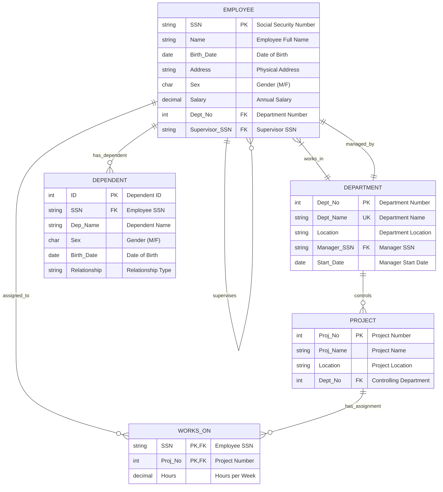

# Employee Management System - ER Diagram Documentation

## Project Information

**Student**: DIVYANSH JHA  
**ID**: 2024SL70022  
**Course**: Database Systems and Applications (SESAP ZC337)  
**Faculty**: Balachandra A, BITS Pilani WILP

---

## 1. Detailed ER Diagram Analysis

### 1.1 Problem Requirements Analysis

Based on the BITS Pilani assignment guidelines, our Employee Management System must handle:

1. **Employee Management**: Personal details, department assignment, supervisory relationships
2. **Department Management**: Department info, manager assignments, multi-location capability
3. **Project Management**: Project details, department control, employee assignments
4. **Dependent Management**: Family member information and relationships
5. **Reporting Structure**: Hierarchical supervisor-subordinate relationships

### 1.2 Entity Identification and Detailed Analysis

#### **EMPLOYEE Entity**

- **Purpose**: Stores all personal and professional information about employees
- **Attributes**:

  - `SSN` (Primary Key): Social Security Number - unique identifier
  - `Name`: Full employee name
  - `Birth_Date`: Date of birth for age calculations and records
  - `Address`: Physical address for contact purposes
  - `Sex`: Gender information ('M' or 'F')
  - `Salary`: Annual compensation amount
  - `Dept_No` (Foreign Key): Links to department where employee works
  - `Supervisor_SSN` (Foreign Key): References another employee who supervises this employee

- **Business Rules**:
  - Each employee must have a unique SSN
  - Each employee works in exactly one department
  - Each employee can have at most one direct supervisor
  - An employee can supervise multiple other employees
  - Salary must be a positive value

#### **DEPARTMENT Entity**

- **Purpose**: Represents organizational units within the company
- **Attributes**:

  - `Dept_No` (Primary Key): Unique department identifier
  - `Dept_Name`: Name of the department (must be unique)
  - `Location`: Physical location of the department
  - `Manager_SSN` (Foreign Key): Employee who manages this department
  - `Start_Date`: Date when current manager started or department was established

- **Business Rules**:
  - Each department has a unique number and name
  - Each department has exactly one manager (who is an employee)
  - A manager can only manage one department at a time
  - Departments can have multiple employees working in them

#### **PROJECT Entity**

- **Purpose**: Represents projects undertaken by the organization
- **Attributes**:

  - `Proj_No` (Primary Key): Unique project identifier
  - `Proj_Name`: Name/title of the project
  - `Location`: Where the project is being executed
  - `Dept_No` (Foreign Key): Department that controls/owns this project

- **Business Rules**:
  - Each project has a unique project number
  - Each project is controlled by exactly one department
  - Projects can have multiple employees working on them
  - Employees can work on multiple projects simultaneously

#### **DEPENDENT Entity** (Weak Entity)

- **Purpose**: Stores information about employee family members
- **Attributes**:

  - `ID` (Primary Key): Auto-generated unique identifier
  - `SSN` (Foreign Key): Employee to whom this dependent belongs
  - `Dep_Name`: Name of the dependent
  - `Sex`: Gender of the dependent ('M' or 'F')
  - `Birth_Date`: Date of birth of the dependent
  - `Relationship`: Type of relationship (Spouse, Son, Daughter, Parent, Other)

- **Business Rules**:
  - Dependents cannot exist without an associated employee
  - Each dependent belongs to exactly one employee
  - An employee can have multiple dependents
  - Relationship type must be from predefined list

#### **WORKS_ON Relationship Entity**

- **Purpose**: Manages many-to-many relationship between employees and projects
- **Attributes**:

  - `SSN` (Primary Key, Foreign Key): Employee working on project
  - `Proj_No` (Primary Key, Foreign Key): Project being worked on
  - `Hours`: Number of hours per week dedicated to this project

- **Business Rules**:
  - An employee can work on multiple projects
  - A project can have multiple employees assigned
  - Hours must be between 0 and 80 per week per project
  - Each employee-project combination is unique

### 1.3 Relationship Analysis

#### **1. EMPLOYEE - DEPARTMENT Relationship (Works_In)**

- **Type**: Many-to-One (M:1)
- **Cardinality**: Each employee works in exactly one department, but a department can have many employees
- **Participation**: Total participation from Employee side (every employee must work in a department)

#### **2. EMPLOYEE - EMPLOYEE Relationship (Supervises)**

- **Type**: One-to-Many (1:M) Recursive Relationship
- **Cardinality**: Each employee can have at most one supervisor, but can supervise many employees
- **Participation**: Partial participation (not all employees are supervisors, top-level employees have no supervisors)

#### **3. DEPARTMENT - EMPLOYEE Relationship (Manages)**

- **Type**: One-to-One (1:1)
- **Cardinality**: Each department has exactly one manager, each manager manages exactly one department
- **Participation**: Total participation from Department side (every department must have a manager)

#### **4. DEPARTMENT - PROJECT Relationship (Controls)**

- **Type**: One-to-Many (1:M)
- **Cardinality**: Each department can control multiple projects, each project is controlled by exactly one department
- **Participation**: Total participation from Project side (every project must be controlled by a department)

#### **5. EMPLOYEE - PROJECT Relationship (Works_On)**

- **Type**: Many-to-Many (M:N)
- **Cardinality**: Employees can work on multiple projects, projects can have multiple employees
- **Attributes**: Hours (number of hours per week)
- **Participation**: Partial participation from both sides

#### **6. EMPLOYEE - DEPENDENT Relationship (Has_Dependent)**

- **Type**: One-to-Many (1:M)
- **Cardinality**: Each employee can have multiple dependents, each dependent belongs to exactly one employee
- **Participation**: Partial participation from Employee side (not all employees have dependents)

---

## 2. Simple Explanation of the ER Diagram

Think of this ER diagram like organizing a company's information:

### **The Main Players (Entities):**

1. **EMPLOYEES** - These are all the people working in the company

   - Each person has basic info like name, address, birth date, and salary
   - Each person has a unique Social Security Number (SSN) as their ID card
   - Each person works in one department and might have a boss (supervisor)

2. **DEPARTMENTS** - These are the different sections of the company

   - Like "Engineering", "Marketing", "HR"
   - Each department has a number, name, location, and one manager
   - The manager is someone from the employees

3. **PROJECTS** - These are the work assignments the company does

   - Like "Build Mobile App" or "Marketing Campaign"
   - Each project belongs to one department
   - Multiple employees can work on one project

4. **DEPENDENTS** - These are family members of employees

   - Like spouse, children, parents
   - Important for benefits and emergency contacts

5. **WORKS_ON** - This tracks who works on which project and for how many hours

### **How They Connect (Relationships):**

- **Employee ↔ Department**: Every employee works in one department, departments have many employees
- **Employee ↔ Employee**: Some employees supervise others (boss-subordinate relationship)
- **Department ↔ Manager**: Each department has one manager (who is an employee)
- **Department ↔ Projects**: Each department controls multiple projects
- **Employee ↔ Projects**: Employees can work on multiple projects (tracked with hours)
- **Employee ↔ Dependents**: Employees can have multiple family members as dependents

### **Business Rules Made Simple:**

- Every employee must work in exactly one department
- Every employee can have only one direct boss (but can be boss to many others)
- Every project must belong to one department
- Employees can work on multiple projects, but total hours can't exceed 80 per week
- Family members (dependents) are linked to specific employees

---

## 3. Entity-Relationship Diagram Constraints

### 3.1 Entity Constraints

- **EMPLOYEE**: SSN is unique and required
- **DEPARTMENT**: Dept_No is unique, Dept_Name is unique
- **PROJECT**: Proj_No is unique
- **DEPENDENT**: ID is unique (auto-generated)
- **WORKS_ON**: Combination of (SSN, Proj_No) is unique

### 3.2 Referential Integrity Constraints

- Employee.Dept_No → Department.Dept_No
- Employee.Supervisor_SSN → Employee.SSN
- Department.Manager_SSN → Employee.SSN
- Project.Dept_No → Department.Dept_No
- Works_On.SSN → Employee.SSN
- Works_On.Proj_No → Project.Proj_No
- Dependent.SSN → Employee.SSN

### 3.3 Domain Constraints

- Sex ∈ {'M', 'F'}
- Salary > 0
- Hours ≥ 0 AND Hours ≤ 80
- Relationship ∈ {'Spouse', 'Son', 'Daughter', 'Parent', 'Other'}

---

## 4. Mermaid ER Diagram Code

---

## 5. Advanced ER Diagram Features

### 5.1 Cardinality Notations Used

- `||--||` : One-to-One relationship
- `||--o{` : One-to-Many relationship
- `}|--||` : Many-to-One relationship
- `}|--o{` : Many-to-Many relationship

### 5.2 Key Constraints Legend

- `PK` : Primary Key
- `FK` : Foreign Key
- `UK` : Unique Key
- `PK,FK` : Composite Primary Key that is also Foreign Key

### 5.3 Participation Constraints

- **Total Participation** (double line): Every entity must participate
  - Every Employee must work in a Department
  - Every Project must be controlled by a Department
- **Partial Participation** (single line): Not all entities need to participate
  - Not all Employees are supervisors
  - Not all Employees have dependents

---

## 6. Normalization Considerations

The ER diagram is designed to achieve:

- **1NF**: All attributes are atomic (no multi-valued attributes)
- **2NF**: No partial dependencies (all non-key attributes fully depend on primary key)
- **3NF**: No transitive dependencies (no non-key attribute depends on another non-key attribute)
- **BCNF**: Every determinant is a candidate key

### Normalization Examples:

- **WORKS_ON** relationship properly handles the many-to-many relationship between Employee and Project
- **DEPENDENT** has its own primary key to avoid anomalies
- No redundant storage of derived attributes (like age, which can be calculated from birth_date)

---

## 7. Future Extension Capabilities

The ER diagram is designed to support future multimodal extensions:

### 7.1 Spatial Data Extensions

- **DEPARTMENT.Location** → Can be extended to store GIS coordinates
- **PROJECT.Location** → Can include spatial boundaries and geographic data

### 7.2 Multimedia Extensions

- **EMPLOYEE.Photo** → BLOB field for employee photos
- **PROJECT.Documents** → Store project documentation and files
- **DEPARTMENT.FloorPlan** → Office layout images

### 7.3 JSON Data Extensions

- **EMPLOYEE.Skills** → JSON field for technical competencies
- **PROJECT.Requirements** → JSON field for project specifications
- **DEPARTMENT.Policies** → JSON field for departmental procedures

This ER diagram provides a solid foundation for the current requirements while maintaining flexibility for future organizational and technological needs.
